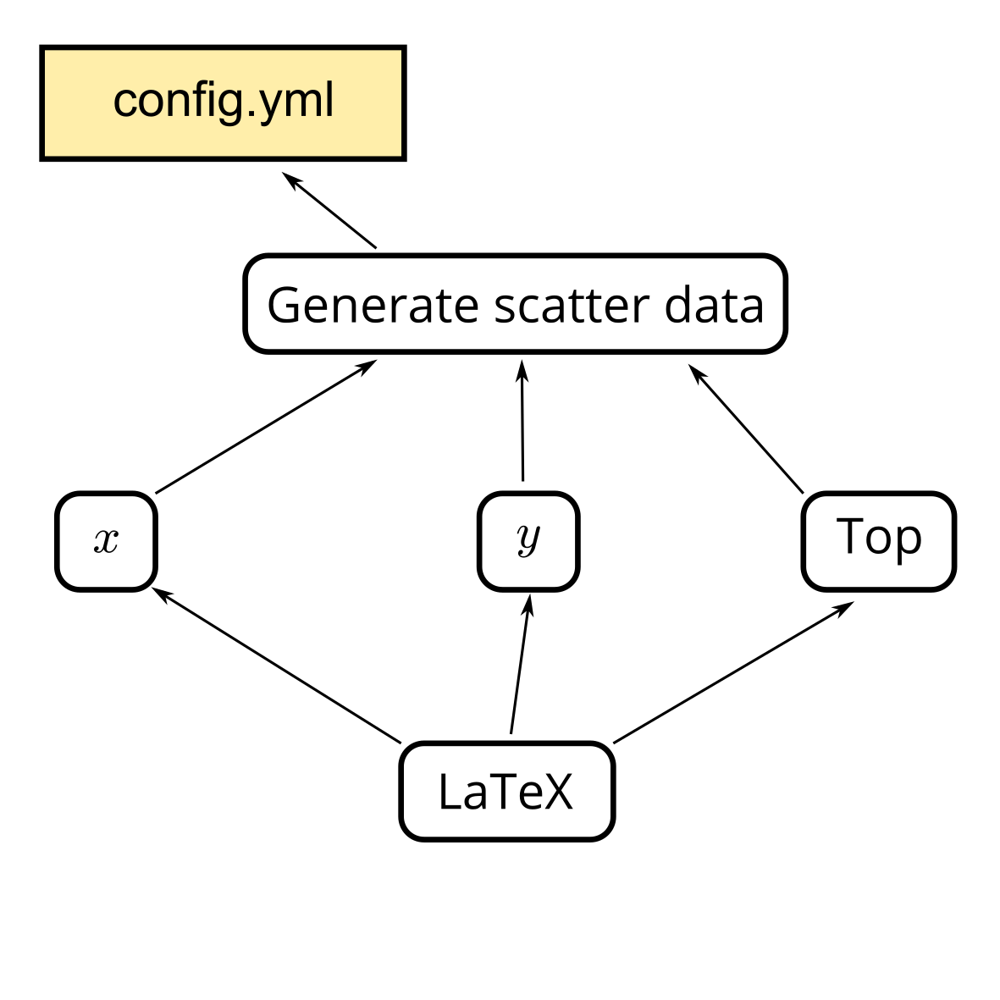

This document is intended as hands-on instructions for the [CAF
tutorial](https://indico.cern.ch/event/771763/). Since the
instructions should be self-contained, it can also be used as a offline resource. The only
prerequisite of this tutorial is a working
[CAF](https://gitlab.cern.ch/atlas-caf/CAFCore) installation. You can check this
by running

<!-- console -->
```bash
$ python -c "import QFramework"
RooFit v3.60 -- Developed by Wouter Verkerke and David Kirkby 
                Copyright (C) 2000-2013 NIKHEF, University of California & Stanford University
                All rights reserved, please read http://roofit.sourceforge.net/license.txt
```

This part of the tutorial illustrates the submission functionality of the common analysis
helpers in a more complex scenario. The idea is that we want to automate the
process of making a paper. In this example, the creation of the final PDF-File
comprises the following steps

 1. **Creation of pseudo-random data**:
    The final paper should contain nice histograms whose events are drawn from a
    multivariate gaussian. The first step reads in a [configuration
    file](config.yml) and draws pairs of numbers $(x, y)$ from the multivariate
    distribution. The configuratino defines the properties of the multivariate
    distribution. The paris of numbers are writte to a file called
    `scatter_data.txt`. Everytime the configuraiton is changed, we should rerun
    the first step, in order to have an up-to-date version of the scatter-data.

  2. **Creation of histograms**:
    The next steps consists of three scripts which read the `scatter_data.txt`
    file and create plots in PDF format. The scripts do not depend on each
    other, so we can run them in parallel. Everytime the scatter data file is
    changed, we want to rerun this stage.

  3. **Compile paper**:
    The last step consist of a single `pdflatex` command with converts the
    `paper.txt` draft into the final PDF-file. Our paper contains the plots
    from the previous stage. If the plots change, we should recompile the PDF.

The individual steps listed above aren't actually CPU intensive, so we could
execute them sequentially or with a [Makefile](.Makefile) on the local machine,
but for the sake of this tutorial, we will set up a submission script, such that
the individual steps are submitted to the batch system.

Have a look at the individual scripts and run them to see what they do. Also,
have a look at the LaTeX document and try to compile it.

  - (`create_scatter_data.py`)[create_scatter_data.py] Reads the configuration
    file, draws x- and y-values form the random distribution and stores the
    values in a text file called `scatter_data.txt`.
  - (`x_view.py`)[x_view.py] Read the scatter data and creates a histogram of
    all x-values. The resulting plot is saved to `x.pdf`.
  - (`y_view.py`)[y_view.py] Read the scatter data and creates a histogram of
    all y-values. The resulting plot is saved to `y.pdf`.
  - (`top_view.py`)[top_view.py] Read the scatter data and creates a histogram of
    all top-values. The resulting plot is saved to `top.pdf`.
  - The last step compiles a LaTeX document (`paper.tex`)[paper.tex]. The LaTeX
    document includes the three plots generated by the previous steps.

(Please note, that this example does not follow best programming practices
because the plotting scripts have a lot of duplicated code. A better approach
would be to a shared code base which is capable of generating all three plots.
However for this tutorial it is more convenient to have three files.)

The above list of tasks and their dependencies is best visualized in a graph (a
directed acyclic graph, to be precise).



The submission helpers are able to deal with this sort of dependency graph. To
be more precise, the submission helpers were specifically made to work on such
a structure.

In the [previous example](../submission-hello) you have already seen how to
create a task object and how to instruct the local batch system to work on the
a single task. If the tasks have dependencies, submitting the task to the batch
system means, submitting all its dependencies as all (if all necessary).

> TasK: The file `submit_paper.py` contains a skeleton of a script to submit this kind
  of graph. Work on the three parts marked with `TODO`

Once the script is implemented completely, you should be able to create the
paper using batch jobs.

> Task: The submission helpers only submit jobs whose output is not present.
   - Delete `x.pdf` and see which jobs are resubmitted.
   - Delete `scatter_data.txt` and see which jobs are resubmitted.

> Task: When the `submit_paper.py` script is executed with the `--checkmissing`
  argument you get a list of all jobs which are to be submitted or still
  running. Repeat the steps from the previous task but this time with the
  `--checkmissing` flag.

> Task: Change the setting in `config.yml` and check which jobs are resubmitted.
  Add the `--checktimestamp` argument and see how the result changes.
